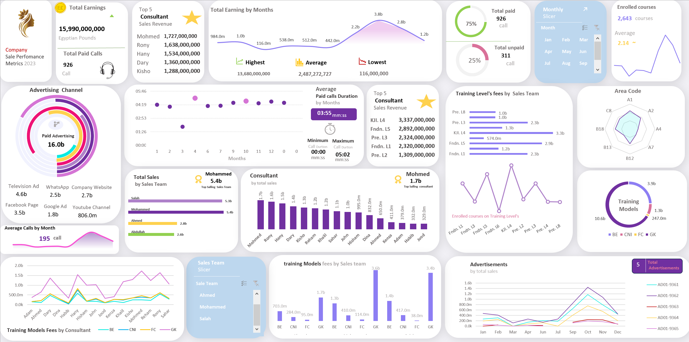
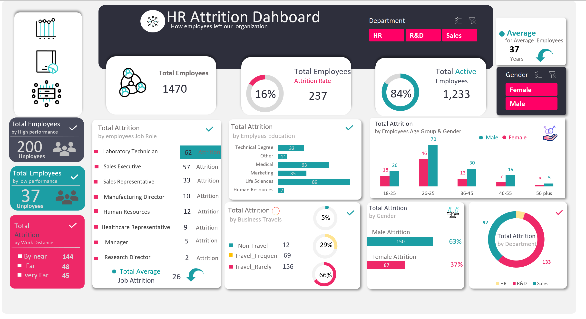

# Excel-Projects

### [Analyzing Business Insights for Bike Storee](https://www.linkedin.com/feed/update/urn:li:activity:7218037173088886784/) | [Link](https://www.linkedin.com/feed/update/urn:li:activity:7218037173088886784/)

In reviewing our recent financial performance, several key insights have emerged that shape our strategic recommendations for the future:

- Understanding Revenue Trends:
We observed a decline in total revenue from $3,845,515 in 2017 to $2,023,989 in 2018, signaling a need for focused strategic adjustments.

- Spotlight on Monthly and Geographic Revenue Distribution:
April 2018 stood out with $900,000 in revenue, comprising 44.5% of our annual total—a crucial outlier month. Geographically, New York led with $5,826,242, followed by California at $1,790,146 and Texas at $962,601.

- Brand and Product Performance:
Marcelene Boyer emerged as our top-performing brand, while Mountain Bikes dominated sales with $3,030,776 in revenue. Cruisers Bicycles, with 1,378 orders totaling $1,109,151, showcased strong customer demand.

### [Sales performce](https://www.linkedin.com/posts/hegazy-ahmed_excel-dataanalyst-datavisualization-activity-7116746036001275904-J6TA?utm_source=share&utm_medium=member_desktop) | [Link](https://www.linkedin.com/posts/hegazy-ahmed_excel-dataanalyst-datavisualization-activity-7116746036001275904-J6TA?utm_source=share&utm_medium=member_desktop)

the company earned a total of 15,990,000,000 EGP in 2023. Top consultants by sales revenue include Mohmed, Rony, Hany, Dary, and Kisho, with Mohmed leading at 1,727,000,000 EGP. Monthly earnings peaked at 3.8 billion EGP and fluctuated throughout the year, rising notably towards the end.
Of the 926 total paid calls, they accounted for 75% of all calls, with an average duration of 3 minutes and 55 seconds. Advertising expenditure totaled 16 billion EGP, with Television Ads and Facebook being the largest channels. The top sales teams were Mohammed and Salah, each with over 5 billion EGP in sales.
KJL.L4 generated the highest fees among training levels at 3.3 billion EGP. BE and GK training models had the highest consultant fees. There was an average of 195 calls per month and 2,643 courses enrolled.
Advertisement performance varied, showing peaks in certain months, and area code performance was diverse across different regions.

### [HR Attrition dashboard using Excel](https://www.linkedin.com/posts/hegazy-ahmed_hello-everyone-i-have-created-this-hr-attrition-activity-7121396252549758976-5rpk?utm_source=share&utm_medium=member_desktop) | [Link to Project](https://www.linkedin.com/posts/hegazy-ahmed_hello-everyone-i-have-created-this-hr-attrition-activity-7121396252549758976-5rpk?utm_source=share&utm_medium=member_desktop)

- Data Cleaning: In this step includes removing inconsistencies in data, errors, and duplicates and ensuring that the data with which I worked is accurate and reliable for further analysis.
- Data Processing: using Power Query Editor to Create some new columns that involved organizing, sorting, and filtering the data to extract meaningful insights.
Data Analysis: Used various statistical methods to get valuable insights from the data.

**KPIs**
-	What is the total number of employees and the attrition rate within the organization?
-	How many high-performing employees have left compared to low-performing employees?
-	What is the attrition rate based on employees' work distance from the office?
-	Which job roles experience the highest levels of attrition?
-	How does attrition vary by employee education levels?
-	What is the attrition rate among employees who frequently travel for business?
-	 What are the attrition rates by gender?
-	Which departments have the highest attrition rates?
-	Which age group experiences the highest attrition, and what is the average age of employees leaving the organization?
  
  
  
  
